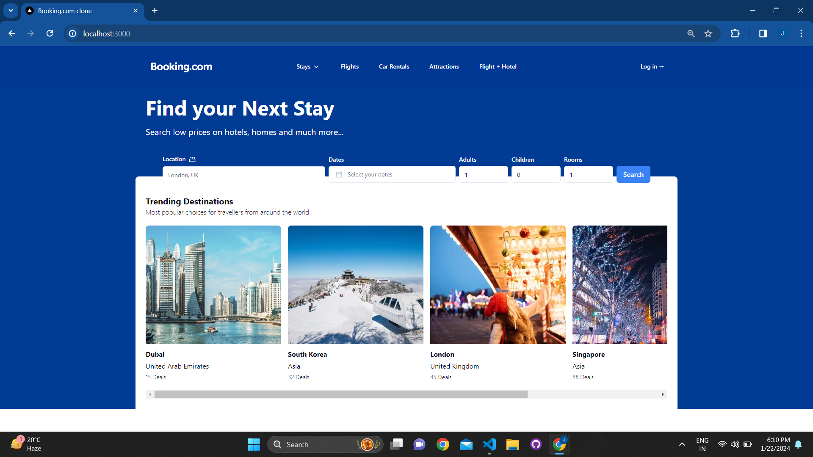
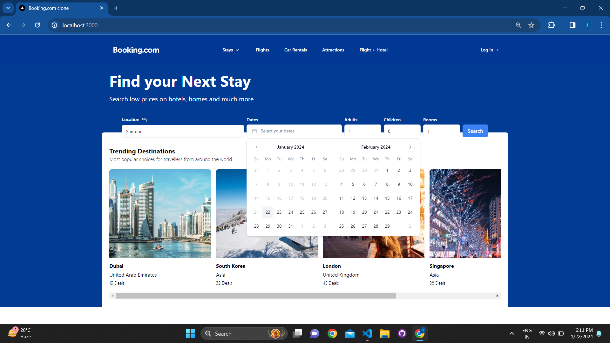
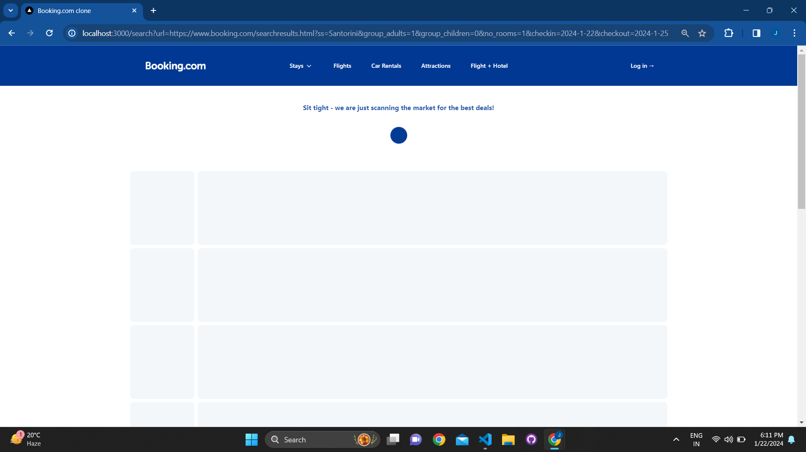
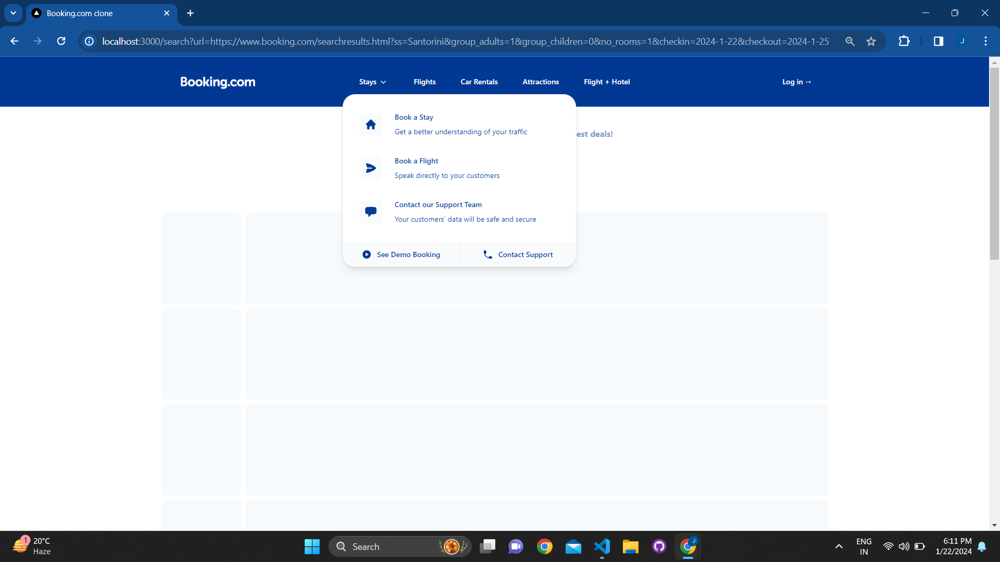
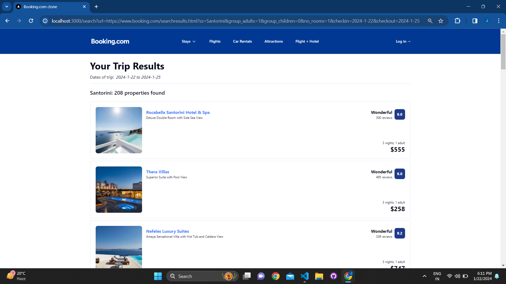
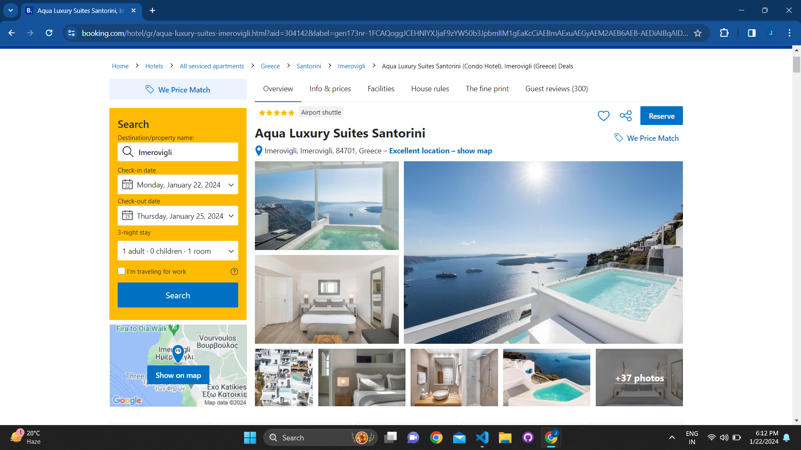

# Booking Clone

Welcome to my Booking.com clone project! 🌐 This application replicates the core functionalities of Booking.com, offering a seamless booking experience.

## Features

### Home Page

- **Location Selection**: Choose your desired location for booking.

- **Date Picker**: Select check-in and check-out dates.
- **Guest Information**: Specify the number of adults, rooms, and children.

### Search Page

- **Search Results**: Browse available hotels based on your criteria.

### Hotel Details

- **Clickable Hotels**: Click on a hotel name to view detailed information.
- **Redirect to Booking.com**: Experience a seamless transition to the official Booking.com page for the selected hotel.

## Tech Stack

- **React**: Frontend library for building user interfaces.
- **Next.js**: React framework for server-side rendering and easy project setup.
- **Tailwind CSS**: Utility-first CSS framework for quick and responsive styling.
- **Shadcn**: Stylish components enhancing the visual appeal of the application.
- **Oxylabs**: Efficient web scraping for seamless data retrieval.

## Getting Started

1. Clone the repository: `git clone https://github.com/jyotimanglani/booking-clone.git`
2. Install dependencies: `npm install`
3. Run the development server: `npm run dev`

Feel free to explore, tweak, and enhance this Booking.com clone. Happy coding! 🚀💻

**Note**: Ensure to handle sensitive information securely, especially if deploying the application.
